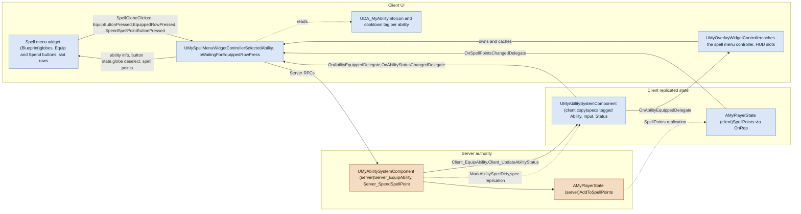
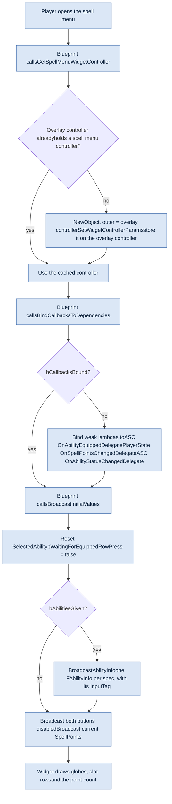
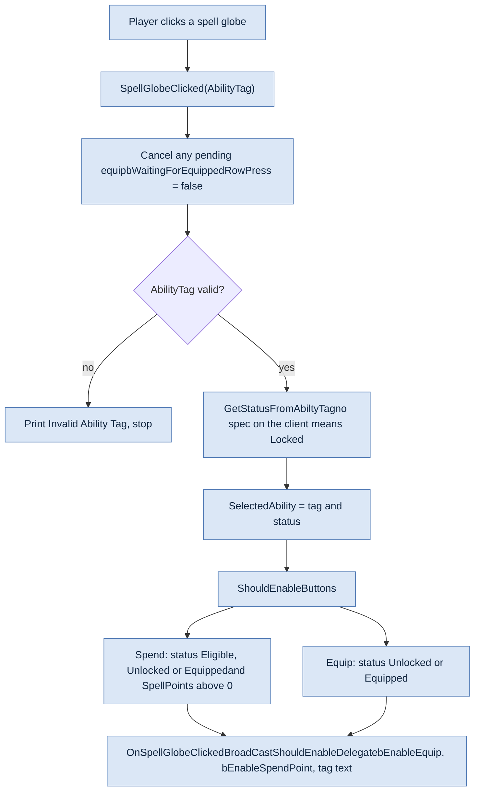
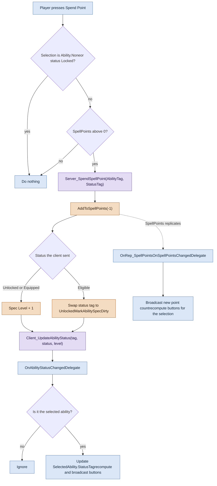
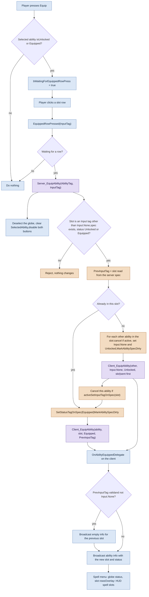

AuraRedo3 · redo3 · a63041a

# Aura Spell Menu Flow

How the spell menu widget, its controller, the ability system component and the player state work together, from opening the menu to equipping a spell into an input slot.

Runs on the owning client Runs on the server Reliable RPC crossing the network

1. [Structure](#structure)
2. [Opening the menu](#open)
3. [Selecting a globe](#select)
4. [Spending a point](#spend)
5. [Equipping into a slot](#equip)

OVERVIEW

## Structure

The widget only talks to its controller. The controller sends requests to the server through the ability system component, and hears back through delegates on the client copy of the ASC and the player state.

Solid arrows are calls, RPCs and delegate broadcasts. Dotted arrows are property replication or plain reads.

FLOW 1

## Opening the menu

The controller is created once and cached on the overlay controller. Every later open reuses it, binds nothing new, and starts with nothing selected.

**In code**

- `Private/StaticLib/MyBPFuncLib.cpp:42` GetSpellMenuWidgetController
- `Private/UI/WidgetControllers/SpellMenu/MySpellMenuWidgetController.cpp:12` BindCallbacksToDependencies
- `Private/UI/WidgetControllers/SpellMenu/MySpellMenuWidgetController.cpp:105` BroadcastInitialValues
- `Private/UI/WidgetControllers/MyWidgetController.cpp:26` BroadcastAbilityInfo

**Assumed from the Blueprint:** the widget calls BindCallbacksToDependencies and BroadcastInitialValues each time it opens. Those calls live in the widget Blueprint, not in C++.

FLOW 2

## Selecting a globe

Clicking a globe is the only thing that sets the selection. The buttons are worked out from the ability's status and the spell point count.

**In code**

- `Private/UI/WidgetControllers/SpellMenu/MySpellMenuWidgetController.cpp:121` SpellGlobeClicked
- `Private/UI/WidgetControllers/SpellMenu/MySpellMenuWidgetController.cpp:89` ShouldEnableButtons
- `Private/AbilitySystem/MyAbilitySystemComponent.cpp:31` GetStatusFromAbiltyTag

FLOW 3

## Spending a spell point

The server takes the point and either unlocks the ability or levels it up. Two separate paths bring the result back: the status RPC and the replicated point count.

**In code**

- `Private/UI/WidgetControllers/SpellMenu/MySpellMenuWidgetController.cpp:151` SpendSpellPointButtonPressed
- `Private/AbilitySystem/MyAbilitySystemComponent.cpp:214` Server_SpendSpellPoint
- `Private/AbilitySystem/MyAbilitySystemComponent.cpp:244` Client_UpdateAbilityStatus

**Not yet hardened:** Server_SpendSpellPoint still trusts the StatusTag the client sends and does not null-check the spec. The equip path below was fixed for the same problems; this one was not part of that change.

FLOW 4

## Equipping into a slot

Equip is two clicks: the button arms it, then a slot row sends it. The server reads the current slot from its own spec, empties the target slot, and tells the client about every ability it changed.

**In code**

- `Private/UI/WidgetControllers/SpellMenu/MySpellMenuWidgetController.cpp:144` EquipButtonPressed
- `Private/UI/WidgetControllers/SpellMenu/MySpellMenuWidgetController.cpp:162` EquippedRowPressed
- `Private/AbilitySystem/MyAbilitySystemComponent.cpp:250` Server_EquipAbility
- `Private/AbilitySystem/MyAbilitySystemComponent.cpp:112` SetInputTagOnSpec, `:121` SetStatusTagOnSpec
- `Private/AbilitySystem/MyAbilitySystemComponent.cpp:295` Client_EquipAbility
- `Private/UI/WidgetControllers/Overlay/MyOverlayWidgetController.cpp:93` overlay equip handler

Equipping into an occupied slot does not swap. The ability that was there loses its slot and goes back to Unlocked. Reliable RPCs to the same actor arrive in order, so the client clears the slot before it refills it.

All paths are under `Source/Aura/`. Line numbers match commit a63041a on redo3.